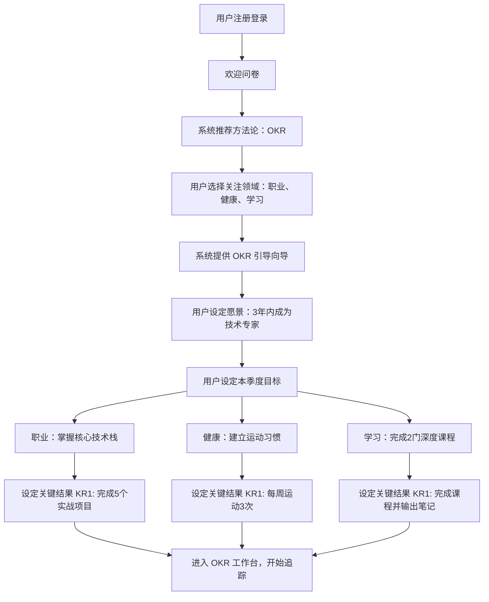
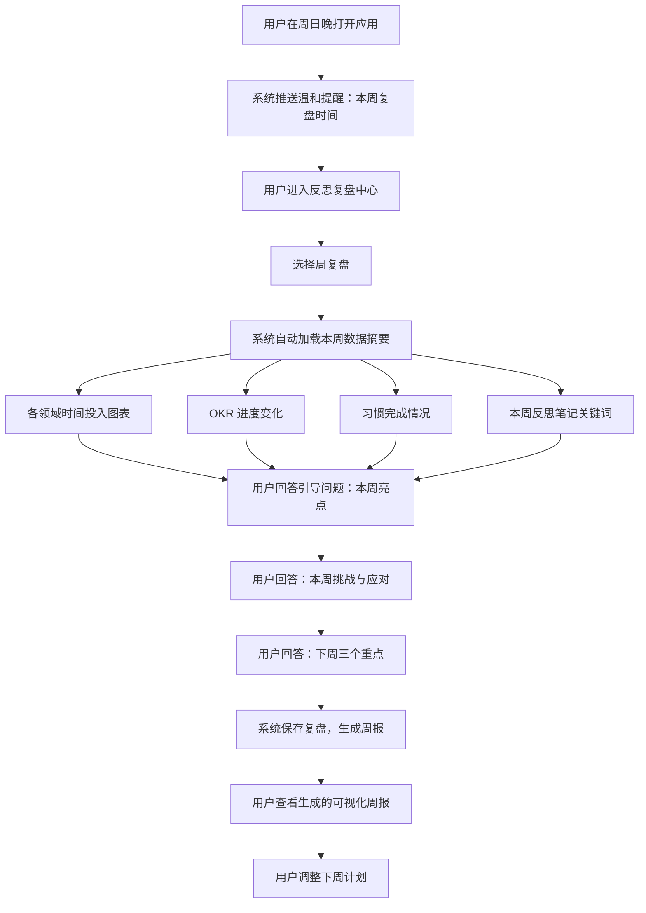
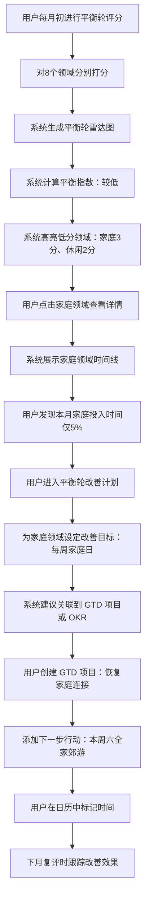
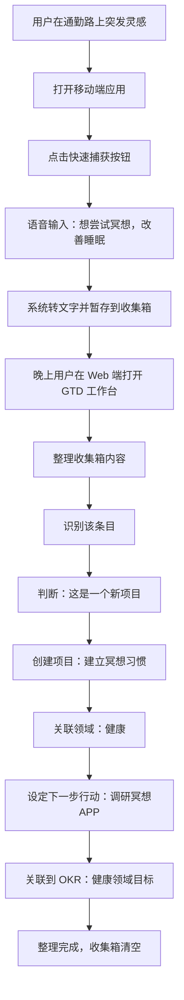

# 人生管理系统架构设计

## 1. 系统愿景

构建一个以"梳理与反思"为核心的人生管理系统，帮助用户从多维度审视生活状态、规划目标方向、沉淀经验智慧。系统支持多种成熟的人生管理方法论，用户可根据当前阶段和个人偏好灵活选择，实现工作、生活、家庭、健康等各领域的平衡发展。

**核心价值主张**：
- 不是任务清单工具，而是生活状态的仪表盘
- 不是记录流水账，而是促进深度思考与成长
- 不是单一方法论，而是方法论工具箱

## 2. 系统核心领域模型

### 2.1 生活领域（Life Domain）

系统将人生划分为可配置的领域维度，默认包括但不限于：

| 领域标识 | 领域名称 | 典型关注点 |
|---------|---------|-----------|
| Career | 职业发展 | 技能成长、职位晋升、职业规划 |
| Health | 身心健康 | 运动、饮食、睡眠、心理状态 |
| Family | 家庭关系 | 亲子关系、伴侣关系、原生家庭 |
| Finance | 财务状况 | 收支管理、资产配置、财务自由度 |
| Learning | 学习成长 | 知识积累、技能培养、认知升级 |
| Social | 社交人际 | 友情维护、社交圈层、人脉网络 |
| Leisure | 休闲娱乐 | 兴趣爱好、文化消费、放松恢复 |
| Spirituality | 精神世界 | 价值观、人生意义、内在和谐 |

**领域特性**：
- 用户可自定义添加、删除、重命名领域
- 每个领域支持设置权重（反映当前阶段的重要性）
- 领域间可建立关联关系（如健康影响工作效能）

### 2.2 管理方法论（Methodology）

系统内置多种人生管理方法论，作为可切换的"视角模式"：

#### 方法论一：GTD 生活版（Getting Things Done for Life）

**核心理念**：通过收集、整理、组织、回顾、执行五个步骤，清空大脑压力，专注当下行动。

**应用场景**：
- 生活事务繁杂，需要系统性整理
- 多领域任务交织，需要清晰分类
- 倾向于"清空收件箱"的控制感

**核心要素**：
- 收集箱（Inbox）：捕获所有想法、待处理事项
- 项目（Project）：需要多步骤完成的目标（跨领域）
- 行动（Action）：可执行的具体下一步
- 参考资料（Reference）：不需行动但有价值的信息
- 等待清单（Waiting For）：委托他人或等待外部条件的事项
- 日历（Calendar）：时间敏感事项
- 回顾机制（Review）：每日、每周、每月的检视流程

#### 方法论二：OKR 人生版（Objectives and Key Results for Life）

**核心理念**：设定有挑战性的目标（Objective），通过可衡量的关键结果（Key Results）追踪进展。

**应用场景**：
- 处于人生转折期，需要明确方向
- 倾向于目标驱动，追求突破性成长
- 需要阶段性（季度/年度）目标管理

**核心要素**：
- 愿景（Vision）：长期（3-5年）的人生愿景
- 目标（Objective）：季度或年度的定性目标（按领域设置）
- 关键结果（Key Result）：可量化的成果指标（2-5个/目标）
- 信心指数（Confidence）：对达成目标的信心评估（动态更新）
- 对齐关系（Alignment）：不同领域目标间的支撑或冲突关系

#### 方法论三：生活平衡轮（Life Balance Wheel）

**核心理念**：通过可视化各领域的满意度，识别失衡区域，制定调整策略。

**应用场景**：
- 感觉生活失衡，但不清楚具体问题
- 需要定期进行全局体检
- 倾向于直观的可视化反馈

**核心要素**：
- 领域评分（Domain Score）：定期对每个领域打分（1-10分）
- 平衡指数（Balance Index）：领域间方差，反映整体平衡度
- 满意度曲线（Satisfaction Trend）：各领域分数的时间趋势
- 改善计划（Improvement Plan）：针对低分领域的提升策略

#### 方法论四：时间矩阵（Eisenhower Matrix for Life）

**核心理念**：按重要性和紧急性将生活事项分为四个象限，优化时间精力分配。

**应用场景**：
- 总是陷入紧急事务，缺少战略思考
- 需要识别真正重要的长期事项
- 倾向于时间效能管理

**核心要素**：
- 象限一（重要且紧急）：危机、截止期问题
- 象限二（重要不紧急）：规划、能力建设、关系维护
- 象限三（紧急不重要）：部分电话、邮件、会议
- 象限四（不重要不紧急）：琐事、消遣
- 时间分配分析（Time Allocation）：各象限实际时间占比统计
- 理想分配目标（Target Allocation）：设定象限二的目标时间占比

### 2.3 记录与沉淀（Capture & Reflection）

#### 混合记录模式

**结构化记录**：
- 领域状态快照：定期对各领域进行多维度评估
  - 满意度评分（主观感受）
  - 投入时间统计（客观数据）
  - 关键指标记录（如健康：体重、睡眠时长）
- 目标进度更新：关键结果达成百分比、里程碑完成情况
- 习惯打卡：重复性行为的执行记录

**自由文本记录**：
- 每日反思（Daily Reflection）：开放式记录当天感受、思考、事件
- 周期复盘（Periodic Review）：每周/月/季/年的深度回顾
  - 成就与亮点
  - 问题与挑战
  - 经验与教训
  - 下阶段调整
- 灵感笔记（Insight Notes）：突发的想法、顿悟、问题

**关联机制**：
- 文本记录可标记关联的领域、目标、方法论
- 支持从结构化数据跳转到相关文本记录
- 支持从文本记录中提取结构化信息（如提及的目标进展）

## 3. 系统功能架构

### 3.1 方法论工作台（Methodology Workspace）

**设计原则**：用户可同时启用多个方法论，系统提供统一的数据模型，不同方法论以不同视角呈现和组织相同的底层数据。

**功能组件**：

#### 方法论切换器
- 展示已启用的方法论列表
- 支持快速切换当前工作视图
- 每个方法论可独立配置参数（如OKR的周期长度）

#### GTD 工作台
- **收集视图**：快速捕获入口，支持语音、文本、图片
- **整理视图**：将收集箱内容分类（项目/行动/参考/等待）
- **项目视图**：按领域分组展示项目及其下一步行动
- **情境视图**：按场景（如@家、@办公室、@通勤）过滤行动
- **回顾面板**：引导式回顾流程，包含检查清单

#### OKR 工作台
- **愿景看板**：展示长期愿景及分解路径
- **目标树**：层级展示当前周期目标与关键结果
- **进度仪表盘**：各目标完成度、健康度（红黄绿灯）
- **对齐图谱**：可视化不同领域目标间的依赖关系
- **信心曲线**：跟踪信心指数变化，识别风险

#### 平衡轮工作台
- **轮盘视图**：雷达图展示各领域当前评分
- **历史对比**：叠加不同时间点的平衡轮，观察变化
- **失衡预警**：当某领域评分持续下降或方差过大时提示
- **改善计划**：为低分领域制定具体行动，关联到其他方法论

#### 时间矩阵工作台
- **象限看板**：四象限卡片式布局
- **拖拽分类**：快速将事项拖入对应象限
- **时间统计**：展示实际时间分配与理想分配对比
- **象限二聚焦**：高亮重要不紧急事项，推荐优先处理

### 3.2 领域中心（Domain Hub）

**设计原则**：以领域为聚合根，整合该领域下所有方法论的数据、记录、目标。

**功能组件**：

#### 领域仪表盘
- 领域基本信息：名称、图标、权重、描述
- 综合评分：融合多个方法论的评估结果
- 趋势图表：满意度、投入时间、目标完成率的时间曲线
- 快速入口：跳转到该领域的GTD项目、OKR目标、改善计划

#### 领域时间线
- 按时间倒序展示该领域的所有活动：
  - 目标设定与完成
  - 状态评分记录
  - 相关反思笔记
  - 习惯打卡记录
- 支持筛选活动类型、时间范围

#### 领域关联分析
- 展示该领域与其他领域的关系：
  - 正向影响（如运动改善工作效能）
  - 负向冲突（如加班影响家庭时间）
  - 基于用户标注和系统推荐

### 3.3 反思复盘中心（Reflection Hub）

**设计原则**：反思是系统的灵魂，通过结构化引导和自由书写结合，促进深度思考。

**功能组件**：

#### 每日反思
- **三省吾身模板**：
  - 今日三件值得庆祝的事
  - 今日三个可改进的点
  - 明日最重要的一件事
- **开放式日记**：自由文本编辑器
- **快速标记**：关联领域、标签、情绪（可选）
- **引用功能**：引用今日的目标进展、习惯完成情况

#### 周期复盘
- **复盘向导**：根据选择的周期（周/月/季/年）提供引导问题
  - 本周期的关键成果是什么？
  - 哪些领域超出预期？哪些领域需要关注？
  - 遇到的最大挑战及应对方式？
  - 对自己的新认知？
  - 下周期的三个重点方向？
- **数据辅助**：自动汇总周期内的关键数据
  - 各领域投入时间
  - 目标完成情况
  - 平衡轮变化
  - 高频标签和主题
- **复盘归档**：历史复盘可检索、对比

#### 洞察笔记库
- **快速捕获**：随时记录灵感、困惑、顿悟
- **分类整理**：支持标签、领域、方法论关联
- **智能关联**：系统推荐相关的历史笔记、目标、复盘
- **知识沉淀**：将零散洞察提炼为个人原则或方法论

### 3.4 数据可视化中心（Visualization Hub）

**设计原则**：用图表说话，让抽象的生活状态变得具体可感。

**功能组件**：

#### 全局仪表盘
- **生活全景图**：
  - 生活平衡轮（当前 vs 上月 vs 去年同期）
  - 各领域健康度评分
  - 本周期 OKR 整体进度
  - GTD 项目活跃度
- **时间分析**：
  - 各领域时间投入分布（饼图）
  - 时间矩阵象限分布（柱状图）
  - 时间投入与满意度相关性（散点图）
- **成长轨迹**：
  - 已完成的重大目标时间轴
  - 习惯养成曲线
  - 能力雷达图（基于自定义能力维度）

#### 专项分析
- **目标健康度报告**：OKR 完成率、信心变化、风险预警
- **领域深度分析**：单一领域的多维度深入图表
- **习惯统计**：打卡率、连续天数、失败模式分析
- **情绪与状态**：情绪标签词云、满意度热力图

#### 对比与预测
- **历史对比**：同比、环比数据对比
- **目标完成预测**：基于当前进度预测最终完成度
- **平衡度预警**：基于趋势预测可能失衡的领域

### 3.5 习惯与日常（Routine & Habit）

**设计原则**：习惯是长期改变的基石，但不是待办清单，而是生活方式的塑造。

**功能组件**：

#### 习惯管理
- **习惯定义**：
  - 习惯名称、关联领域
  - 频率设定（每日/每周几次/每月几次）
  - 目标意义（为什么要养成这个习惯）
- **习惯提醒**：灵活的提醒机制（可选）
- **习惯打卡**：简单快捷的完成标记
- **习惯复盘**：查看完成率、连续天数、失败原因标注

#### 日常模板
- **晨间例行**：设定晨间固定流程（冥想、运动、阅读等）
- **晚间例行**：设定睡前固定流程（反思、计划、放松等）
- **周末例行**：设定周末固定活动（家庭时间、兴趣爱好等）
- **模板执行**：非强制性，作为生活节奏的参考

### 3.6 个人成长档案（Growth Archive）

**设计原则**：系统不仅记录当下，更要沉淀成长，形成个人生命史。

**功能组件**：

#### 里程碑时间轴
- 记录人生重大事件、重要决策、关键转折
- 支持添加照片、文档、详细描述
- 按时间线或领域查看
- 可标注里程碑对后续人生的影响

#### 年度报告
- 自动生成年度生活数据报告：
  - 各领域投入时间总计
  - 完成的重大目标清单
  - 养成的新习惯
  - 阅读、旅行、社交等统计
  - 年度关键词（基于反思笔记提取）
- 支持导出、分享（去隐私化）

#### 原则与智慧库
- **个人原则**：从复盘中提炼的行为准则、决策原则
- **经验教训**：失败教训、成功经验的结构化记录
- **人生问答**：记录人生重要问题及阶段性答案的演变
- **智慧检索**：在面临决策时，检索历史相似情境的处理方式

## 4. 跨平台技术架构

### 4.1 平台覆盖策略

| 平台 | 核心场景 | 功能侧重 |
|------|---------|---------|
| Web 应用 | 深度工作、复盘反思、数据分析 | 完整功能，丰富可视化 |
| 移动端（iOS/Android） | 快速记录、习惯打卡、查看仪表盘 | 轻量高频，便捷输入 |
| 桌面应用（可选） | 专注模式、离线使用 | 性能优化，原生体验 |

### 4.2 数据同步机制

**设计原则**：
- 多端数据实时同步
- 离线优先，本地缓存
- 冲突解决策略（最后写入优先，保留冲突版本供选择）

**同步粒度**：
- 细粒度同步（字段级），减少冲突
- 增量同步，优化网络消耗
- 冲突标记，用户可手动合并

### 4.3 数据持久化模型

**核心实体关系**：

```
用户（User）
  ├─ 领域配置（Domain Config）
  │   ├─ 领域实例（Domain Instance）
  │   │   ├─ 领域评分记录（Domain Score Record）
  │   │   ├─ 领域时间投入记录（Time Investment Record）
  │   │   └─ 领域关联关系（Domain Relationship）
  │   
  ├─ 方法论配置（Methodology Config）
  │   ├─ GTD 数据（GTD Data）
  │   │   ├─ 收集项（Inbox Item）
  │   │   ├─ 项目（Project）
  │   │   ├─ 行动（Action）
  │   │   └─ 参考资料（Reference）
  │   │
  │   ├─ OKR 数据（OKR Data）
  │   │   ├─ 愿景（Vision）
  │   │   ├─ 目标（Objective）
  │   │   ├─ 关键结果（Key Result）
  │   │   └─ 进度更新（Progress Update）
  │   │
  │   ├─ 平衡轮数据（Balance Wheel Data）
  │   │   └─ 评分快照（Score Snapshot）
  │   │
  │   └─ 时间矩阵数据（Time Matrix Data）
  │       └─ 象限事项（Quadrant Item）
  │
  ├─ 反思记录（Reflection Record）
  │   ├─ 每日反思（Daily Reflection）
  │   ├─ 周期复盘（Periodic Review）
  │   └─ 洞察笔记（Insight Note）
  │
  ├─ 习惯管理（Habit Management）
  │   ├─ 习惯定义（Habit Definition）
  │   └─ 习惯执行记录（Habit Execution Record）
  │
  └─ 成长档案（Growth Archive）
      ├─ 里程碑（Milestone）
      ├─ 年度报告（Annual Report）
      └─ 原则智慧（Principle & Wisdom）
```

**数据关联设计**：
- 所有实体均可关联领域（Domain Association）
- 支持跨方法论引用（如 GTD 项目关联 OKR 目标）
- 反思记录可引用任意结构化数据

### 4.4 扩展性设计

**插件化方法论**：
- 方法论以插件形式注册到系统
- 提供标准接口（数据模型、视图组件、引导流程）
- 社区可贡献新方法论（如番茄工作法、子弹笔记法等）

**自定义字段**：
- 用户可为领域、目标、习惯等实体添加自定义字段
- 支持多种字段类型（文本、数字、日期、选项、评分等）
- 自定义字段参与可视化和统计分析

**数据导入导出**：
- 支持从其他工具导入数据（如 Todoist、Notion 等）
- 支持导出为通用格式（JSON、Markdown、CSV）
- 保障数据所有权，防止供应商锁定

## 5. 用户体验设计原则

### 5.1 渐进式引导

**新用户旅程**：
- 首次登录：简短问卷（人生阶段、关注领域、管理倾向）
- 推荐方法论：根据问卷结果推荐1-2个起步方法论
- 快速开始：提供模板化配置（常见领域、示例目标）
- 引导教程：在使用过程中渐进式展示功能（而非一次性培训）

**复杂度控制**：
- 默认隐藏高级功能，按需展开
- 提供"简化模式"与"专家模式"切换
- 避免一次性呈现过多信息，分屏、分步展示

### 5.2 低认知负担

**快速捕获**：
- 全局快捷入口（Web：快捷键，移动端：浮动按钮）
- 自然语言输入，系统智能分类（如"下周要给妈妈打电话"自动归入家庭领域 GTD 行动）
- 语音输入支持

**智能提示**：
- 在适当时机推送温和提醒（如"本周尚未进行周复盘"）
- 基于历史行为预测用户意图（如周日晚常复盘，自动准备好复盘面板）
- 避免强制打断，所有提示可延迟或关闭

**上下文感知**：
- 根据当前时间、地点、历史习惯推荐任务或行动
- 在查看某领域时，自动关联该领域的各方法论数据
- 在复盘时，自动拉取相关数据辅助回顾

### 5.3 情感化设计

**正向反馈**：
- 完成目标、坚持习惯时给予庆祝动画或激励语
- 可视化成长（如等级、徽章、成就），但避免游戏化过度
- 展示长期进步（如"比去年同期提升30%"）

**温和陪伴**：
- 文案语气温暖、非评判性（避免"你又没完成"）
- 失败时提供反思引导而非指责（如"这次未完成，可能的原因是？"）
- 尊重用户节奏，不强制要求每日使用

### 5.4 隐私与安全

**数据隐私**：
- 本地优先存储，云端加密同步
- 用户可选择自托管模式（提供 Docker 部署方案）
- 敏感内容支持额外加密（如密码保护的笔记）

**数据控制**：
- 用户随时导出完整数据
- 支持选择性删除或归档历史数据
- 账户注销时彻底清除数据

## 6. 关键用户场景流程

### 场景一：新用户启动并设定首个季度 OKR



### 场景二：每周日晚间的周复盘流程



### 场景三：通过平衡轮发现生活失衡并调整



### 场景四：跨平台快速捕获与后续整理



## 7. 成功衡量指标

### 7.1 用户行为指标

| 指标类型 | 具体指标 | 目标值 | 说明 |
|---------|---------|-------|------|
| 活跃度 | 周活跃用户比例 | > 60% | 系统被持续使用 |
| 粘性 | 平均每周打开次数 | 3-5次 | 避免过高（焦虑）和过低（遗忘） |
| 深度使用 | 复盘完成率 | > 70% | 核心价值是否被使用 |
| 方法论采纳 | 至少使用2种方法论的用户比例 | > 40% | 多视角管理的价值 |
| 数据沉淀 | 平均每用户反思笔记数 | > 10篇/月 | 深度思考的发生 |

### 7.2 用户价值指标

| 指标类型 | 具体指标 | 测量方式 |
|---------|---------|---------|
| 生活满意度提升 | 平衡轮整体评分变化 | 对比用户首月与第6月平衡轮均分 |
| 目标达成率 | OKR 完成度 | 统计用户设定的 OKR 最终达成比例 |
| 习惯养成 | 习惯坚持时长 | 习惯平均连续打卡天数 |
| 自我认知深度 | 复盘字数与深度 | 复盘内容长度、关键词多样性 |
| 长期留存 | 6个月留存率 | > 50% |

### 7.3 系统健康指标

- 数据同步成功率 > 99.9%
- 移动端启动速度 < 2秒
- Web端复杂图表渲染时间 < 1秒
- 数据冲突率 < 0.1%

## 8. 实施路线图

### 阶段一：MVP（最小可行产品）- 3个月

**目标**：验证核心价值假设，支持单一方法论深度使用。

**功能范围**：
- 用户注册登录、基础配置
- 生活领域管理（默认8领域）
- 单一方法论深度实现（优先 OKR 或生活平衡轮）
- 基础反思记录（每日反思、周复盘）
- 简单数据可视化（领域雷达图、时间曲线）
- Web 端完整功能
- 移动端基础功能（快速记录、查看仪表盘）

**里程碑**：
- 30名种子用户内测
- 平均周活跃度 > 50%
- 收集核心功能反馈

### 阶段二：多方法论整合 - 3个月

**目标**：实现方法论可切换，形成差异化竞争力。

**功能范围**：
- 新增3种方法论（GTD、时间矩阵，另选1种）
- 方法论工作台与切换器
- 跨方法论数据关联
- 增强可视化（对比图表、趋势预测）
- 习惯管理模块
- 数据导入导出

**里程碑**：
- 扩展到500用户
- 至少40%用户使用2种以上方法论
- 6个月留存率 > 40%

### 阶段三：智能化与生态 - 6个月

**目标**：通过智能化降低使用门槛,通过生态扩展长期价值。

**功能范围**：
- 智能分类与推荐（NLP 分析用户输入）
- 个人成长档案（里程碑、年度报告）
- 原则智慧库与检索
- 社区分享功能（去隐私化的方法论模板、复盘模板）
- 插件化方法论体系
- 自托管方案
- 桌面应用（可选）

**里程碑**：
- 用户突破5000
- 社区贡献方法论插件 > 5个
- NPS（净推荐值） > 40

### 阶段四：持续优化与商业化探索

**方向**：
- 企业版（团队目标对齐、文化建设）
- 教练/咨询服务集成（人工辅导与系统结合）
- 高级分析功能（AI 驱动的生活洞察）
- 开放 API，与第三方工具集成（日历、笔记、健康数据等）

## 9. 风险与挑战

### 9.1 产品风险

| 风险 | 影响 | 缓解策略 |
|-----|------|---------|
| 功能复杂度过高，用户学习成本大 | 高 | 渐进式引导、简化模式、丰富教程 |
| 多方法论导致用户困惑 | 中 | 智能推荐起步方法论、清晰说明适用场景 |
| 成为待办清单工具，失去反思本质 | 高 | 产品语言强调"梳理"、定期推送复盘提醒、弱化任务清单 UI |
| 用户坚持使用困难，流失率高 | 高 | 温和提醒、正向激励、展示长期价值 |

### 9.2 技术风险

| 风险 | 影响 | 缓解策略 |
|-----|------|---------|
| 跨平台同步冲突 | 中 | 细粒度同步、冲突标记机制、完善测试 |
| 数据模型设计不当，难以扩展 | 高 | 充分前期设计、预留扩展字段、版本迁移方案 |
| 性能问题（大量历史数据） | 中 | 分页加载、归档机制、索引优化 |

### 9.3 市场风险

| 风险 | 影响 | 缓解策略 |
|-----|------|---------|
| 市场已有成熟竞品（Notion、滴答清单等） | 高 | 聚焦"反思梳理"差异化、多方法论整合优势 |
| 目标用户群体小众 | 中 | 精准定位（追求自我成长的中产知识工作者）、口碑传播 |
| 变现困难（工具类产品付费意愿低） | 中 | 免费版+高级版订阅、企业版、增值服务 |

## 10. 设计决策记录

### 决策一：为何选择"多方法论"而非"单一最优方法"

**背景**：人生管理方法论众多（GTD、OKR、平衡轮等），每种都有拥趸。

**决策**：系统支持多方法论并存，用户可选择。

**理由**：
- 人生阶段不同，适用方法论不同（探索期适合平衡轮，目标明确期适合OKR）
- 不同性格偏好不同方法（控制型喜欢GTD，愿景型喜欢OKR）
- 单一方法论容易陷入僵化，多视角更全面
- 形成差异化竞争优势

**代价**：增加开发复杂度、可能导致用户困惑。

**缓解**：智能推荐、清晰文档、社区案例分享。

### 决策二：为何强调"反思复盘"而非"任务执行"

**背景**：市场上待办清单工具众多，竞争激烈。

**决策**：定位为"反思梳理工具"，弱化任务清单，强化复盘记录。

**理由**：
- 待办清单市场红海，难以突围
- 真正的人生成长来自反思，而非执行更多任务
- 目标用户痛点是"忙而无效""迷失方向"，而非"不够勤奋"
- 反思沉淀形成用户资产，提高迁移成本

**代价**：部分用户期望任务管理功能，可能流失。

**缓解**：保留基础任务功能（GTD 行动），但 UI 不突出，引导到反思。

### 决策三：数据存储策略 - 本地优先 vs 云优先

**背景**：用户对隐私越来越敏感，人生数据属于极隐私数据。

**决策**：采用"本地优先，云端加密同步"策略，并提供自托管选项。

**理由**：
- 人生数据高度敏感，用户担心隐私泄露
- 本地优先提升离线可用性和响应速度
- 自托管满足极客和企业用户需求
- 差异化于纯云端 SaaS 工具

**代价**：增加同步复杂度、服务器成本降低（用户自托管）。

**缓解**：提供便捷的 Docker 自托管方案、官方云服务作为默认选项。

### 决策四：是否引入 AI 辅助

**背景**：AI 可以辅助分类、生成反思问题、提供洞察。

**决策**：MVP 阶段不引入，阶段三引入轻量 AI 功能。

**理由**：
- MVP 验证核心价值，AI 不是必需
- AI 功能开发成本高，且效果需验证
- 过度依赖 AI 可能削弱用户主动思考

**后续规划**：
- 智能分类（NLP 分析用户输入自动归类领域、方法论）
- 反思问题推荐（根据用户状态生成个性化复盘问题）
- 生活洞察（从历史数据中发现模式，如"加班周家庭满意度降低"）

**边界**：AI 作为辅助，不替代用户思考，所有 AI 建议可忽略。
## 1. 系统愿景

构建一个以"梳理与反思"为核心的人生管理系统，帮助用户从多维度审视生活状态、规划目标方向、沉淀经验智慧。系统支持多种成熟的人生管理方法论，用户可根据当前阶段和个人偏好灵活选择，实现工作、生活、家庭、健康等各领域的平衡发展。

**核心价值主张**：
- 不是任务清单工具，而是生活状态的仪表盘
- 不是记录流水账，而是促进深度思考与成长
- 不是单一方法论，而是方法论工具箱

## 2. 系统核心领域模型

### 2.1 生活领域（Life Domain）

系统将人生划分为可配置的领域维度，默认包括但不限于：

| 领域标识 | 领域名称 | 典型关注点 |
|---------|---------|-----------|
| Career | 职业发展 | 技能成长、职位晋升、职业规划 |
| Health | 身心健康 | 运动、饮食、睡眠、心理状态 |
| Family | 家庭关系 | 亲子关系、伴侣关系、原生家庭 |
| Finance | 财务状况 | 收支管理、资产配置、财务自由度 |
| Learning | 学习成长 | 知识积累、技能培养、认知升级 |
| Social | 社交人际 | 友情维护、社交圈层、人脉网络 |
| Leisure | 休闲娱乐 | 兴趣爱好、文化消费、放松恢复 |
| Spirituality | 精神世界 | 价值观、人生意义、内在和谐 |

**领域特性**：
- 用户可自定义添加、删除、重命名领域
- 每个领域支持设置权重（反映当前阶段的重要性）
- 领域间可建立关联关系（如健康影响工作效能）

### 2.2 管理方法论（Methodology）

系统内置多种人生管理方法论，作为可切换的"视角模式"：

#### 方法论一：GTD 生活版（Getting Things Done for Life）

**核心理念**：通过收集、整理、组织、回顾、执行五个步骤，清空大脑压力，专注当下行动。

**应用场景**：
- 生活事务繁杂，需要系统性整理
- 多领域任务交织，需要清晰分类
- 倾向于"清空收件箱"的控制感

**核心要素**：
- 收集箱（Inbox）：捕获所有想法、待处理事项
- 项目（Project）：需要多步骤完成的目标（跨领域）
- 行动（Action）：可执行的具体下一步
- 参考资料（Reference）：不需行动但有价值的信息
- 等待清单（Waiting For）：委托他人或等待外部条件的事项
- 日历（Calendar）：时间敏感事项
- 回顾机制（Review）：每日、每周、每月的检视流程

#### 方法论二：OKR 人生版（Objectives and Key Results for Life）

**核心理念**：设定有挑战性的目标（Objective），通过可衡量的关键结果（Key Results）追踪进展。

**应用场景**：
- 处于人生转折期，需要明确方向
- 倾向于目标驱动，追求突破性成长
- 需要阶段性（季度/年度）目标管理

**核心要素**：
- 愿景（Vision）：长期（3-5年）的人生愿景
- 目标（Objective）：季度或年度的定性目标（按领域设置）
- 关键结果（Key Result）：可量化的成果指标（2-5个/目标）
- 信心指数（Confidence）：对达成目标的信心评估（动态更新）
- 对齐关系（Alignment）：不同领域目标间的支撑或冲突关系

#### 方法论三：生活平衡轮（Life Balance Wheel）

**核心理念**：通过可视化各领域的满意度，识别失衡区域，制定调整策略。

**应用场景**：
- 感觉生活失衡，但不清楚具体问题
- 需要定期进行全局体检
- 倾向于直观的可视化反馈

**核心要素**：
- 领域评分（Domain Score）：定期对每个领域打分（1-10分）
- 平衡指数（Balance Index）：领域间方差，反映整体平衡度
- 满意度曲线（Satisfaction Trend）：各领域分数的时间趋势
- 改善计划（Improvement Plan）：针对低分领域的提升策略

#### 方法论四：时间矩阵（Eisenhower Matrix for Life）

**核心理念**：按重要性和紧急性将生活事项分为四个象限，优化时间精力分配。

**应用场景**：
- 总是陷入紧急事务，缺少战略思考
- 需要识别真正重要的长期事项
- 倾向于时间效能管理

**核心要素**：
- 象限一（重要且紧急）：危机、截止期问题
- 象限二（重要不紧急）：规划、能力建设、关系维护
- 象限三（紧急不重要）：部分电话、邮件、会议
- 象限四（不重要不紧急）：琐事、消遣
- 时间分配分析（Time Allocation）：各象限实际时间占比统计
- 理想分配目标（Target Allocation）：设定象限二的目标时间占比

### 2.3 记录与沉淀（Capture & Reflection）

#### 混合记录模式

**结构化记录**：
- 领域状态快照：定期对各领域进行多维度评估
  - 满意度评分（主观感受）
  - 投入时间统计（客观数据）
  - 关键指标记录（如健康：体重、睡眠时长）
- 目标进度更新：关键结果达成百分比、里程碑完成情况
- 习惯打卡：重复性行为的执行记录

**自由文本记录**：
- 每日反思（Daily Reflection）：开放式记录当天感受、思考、事件
- 周期复盘（Periodic Review）：每周/月/季/年的深度回顾
  - 成就与亮点
  - 问题与挑战
  - 经验与教训
  - 下阶段调整
- 灵感笔记（Insight Notes）：突发的想法、顿悟、问题

**关联机制**：
- 文本记录可标记关联的领域、目标、方法论
- 支持从结构化数据跳转到相关文本记录
- 支持从文本记录中提取结构化信息（如提及的目标进展）

## 3. 系统功能架构

### 3.1 方法论工作台（Methodology Workspace）

**设计原则**：用户可同时启用多个方法论，系统提供统一的数据模型，不同方法论以不同视角呈现和组织相同的底层数据。

**功能组件**：

#### 方法论切换器
- 展示已启用的方法论列表
- 支持快速切换当前工作视图
- 每个方法论可独立配置参数（如OKR的周期长度）

#### GTD 工作台
- **收集视图**：快速捕获入口，支持语音、文本、图片
- **整理视图**：将收集箱内容分类（项目/行动/参考/等待）
- **项目视图**：按领域分组展示项目及其下一步行动
- **情境视图**：按场景（如@家、@办公室、@通勤）过滤行动
- **回顾面板**：引导式回顾流程，包含检查清单

#### OKR 工作台
- **愿景看板**：展示长期愿景及分解路径
- **目标树**：层级展示当前周期目标与关键结果
- **进度仪表盘**：各目标完成度、健康度（红黄绿灯）
- **对齐图谱**：可视化不同领域目标间的依赖关系
- **信心曲线**：跟踪信心指数变化，识别风险

#### 平衡轮工作台
- **轮盘视图**：雷达图展示各领域当前评分
- **历史对比**：叠加不同时间点的平衡轮，观察变化
- **失衡预警**：当某领域评分持续下降或方差过大时提示
- **改善计划**：为低分领域制定具体行动，关联到其他方法论

#### 时间矩阵工作台
- **象限看板**：四象限卡片式布局
- **拖拽分类**：快速将事项拖入对应象限
- **时间统计**：展示实际时间分配与理想分配对比
- **象限二聚焦**：高亮重要不紧急事项，推荐优先处理

### 3.2 领域中心（Domain Hub）

**设计原则**：以领域为聚合根，整合该领域下所有方法论的数据、记录、目标。

**功能组件**：

#### 领域仪表盘
- 领域基本信息：名称、图标、权重、描述
- 综合评分：融合多个方法论的评估结果
- 趋势图表：满意度、投入时间、目标完成率的时间曲线
- 快速入口：跳转到该领域的GTD项目、OKR目标、改善计划

#### 领域时间线
- 按时间倒序展示该领域的所有活动：
  - 目标设定与完成
  - 状态评分记录
  - 相关反思笔记
  - 习惯打卡记录
- 支持筛选活动类型、时间范围

#### 领域关联分析
- 展示该领域与其他领域的关系：
  - 正向影响（如运动改善工作效能）
  - 负向冲突（如加班影响家庭时间）
  - 基于用户标注和系统推荐

### 3.3 反思复盘中心（Reflection Hub）

**设计原则**：反思是系统的灵魂，通过结构化引导和自由书写结合，促进深度思考。

**功能组件**：

#### 每日反思
- **三省吾身模板**：
  - 今日三件值得庆祝的事
  - 今日三个可改进的点
  - 明日最重要的一件事
- **开放式日记**：自由文本编辑器
- **快速标记**：关联领域、标签、情绪（可选）
- **引用功能**：引用今日的目标进展、习惯完成情况

#### 周期复盘
- **复盘向导**：根据选择的周期（周/月/季/年）提供引导问题
  - 本周期的关键成果是什么？
  - 哪些领域超出预期？哪些领域需要关注？
  - 遇到的最大挑战及应对方式？
  - 对自己的新认知？
  - 下周期的三个重点方向？
- **数据辅助**：自动汇总周期内的关键数据
  - 各领域投入时间
  - 目标完成情况
  - 平衡轮变化
  - 高频标签和主题
- **复盘归档**：历史复盘可检索、对比

#### 洞察笔记库
- **快速捕获**：随时记录灵感、困惑、顿悟
- **分类整理**：支持标签、领域、方法论关联
- **智能关联**：系统推荐相关的历史笔记、目标、复盘
- **知识沉淀**：将零散洞察提炼为个人原则或方法论

### 3.4 数据可视化中心（Visualization Hub）

**设计原则**：用图表说话，让抽象的生活状态变得具体可感。

**功能组件**：

#### 全局仪表盘
- **生活全景图**：
  - 生活平衡轮（当前 vs 上月 vs 去年同期）
  - 各领域健康度评分
  - 本周期 OKR 整体进度
  - GTD 项目活跃度
- **时间分析**：
  - 各领域时间投入分布（饼图）
  - 时间矩阵象限分布（柱状图）
  - 时间投入与满意度相关性（散点图）
- **成长轨迹**：
  - 已完成的重大目标时间轴
  - 习惯养成曲线
  - 能力雷达图（基于自定义能力维度）

#### 专项分析
- **目标健康度报告**：OKR 完成率、信心变化、风险预警
- **领域深度分析**：单一领域的多维度深入图表
- **习惯统计**：打卡率、连续天数、失败模式分析
- **情绪与状态**：情绪标签词云、满意度热力图

#### 对比与预测
- **历史对比**：同比、环比数据对比
- **目标完成预测**：基于当前进度预测最终完成度
- **平衡度预警**：基于趋势预测可能失衡的领域

### 3.5 习惯与日常（Routine & Habit）

**设计原则**：习惯是长期改变的基石，但不是待办清单，而是生活方式的塑造。

**功能组件**：

#### 习惯管理
- **习惯定义**：
  - 习惯名称、关联领域
  - 频率设定（每日/每周几次/每月几次）
  - 目标意义（为什么要养成这个习惯）
- **习惯提醒**：灵活的提醒机制（可选）
- **习惯打卡**：简单快捷的完成标记
- **习惯复盘**：查看完成率、连续天数、失败原因标注

#### 日常模板
- **晨间例行**：设定晨间固定流程（冥想、运动、阅读等）
- **晚间例行**：设定睡前固定流程（反思、计划、放松等）
- **周末例行**：设定周末固定活动（家庭时间、兴趣爱好等）
- **模板执行**：非强制性，作为生活节奏的参考

### 3.6 个人成长档案（Growth Archive）

**设计原则**：系统不仅记录当下，更要沉淀成长，形成个人生命史。

**功能组件**：

#### 里程碑时间轴
- 记录人生重大事件、重要决策、关键转折
- 支持添加照片、文档、详细描述
- 按时间线或领域查看
- 可标注里程碑对后续人生的影响

#### 年度报告
- 自动生成年度生活数据报告：
  - 各领域投入时间总计
  - 完成的重大目标清单
  - 养成的新习惯
  - 阅读、旅行、社交等统计
  - 年度关键词（基于反思笔记提取）
- 支持导出、分享（去隐私化）

#### 原则与智慧库
- **个人原则**：从复盘中提炼的行为准则、决策原则
- **经验教训**：失败教训、成功经验的结构化记录
- **人生问答**：记录人生重要问题及阶段性答案的演变
- **智慧检索**：在面临决策时，检索历史相似情境的处理方式

## 4. 跨平台技术架构

### 4.1 平台覆盖策略

| 平台 | 核心场景 | 功能侧重 |
|------|---------|---------|
| Web 应用 | 深度工作、复盘反思、数据分析 | 完整功能，丰富可视化 |
| 移动端（iOS/Android） | 快速记录、习惯打卡、查看仪表盘 | 轻量高频，便捷输入 |
| 桌面应用（可选） | 专注模式、离线使用 | 性能优化，原生体验 |

### 4.2 数据同步机制

**设计原则**：
- 多端数据实时同步
- 离线优先，本地缓存
- 冲突解决策略（最后写入优先，保留冲突版本供选择）

**同步粒度**：
- 细粒度同步（字段级），减少冲突
- 增量同步，优化网络消耗
- 冲突标记，用户可手动合并

### 4.3 数据持久化模型

**核心实体关系**：

```
用户（User）
  ├─ 领域配置（Domain Config）
  │   ├─ 领域实例（Domain Instance）
  │   │   ├─ 领域评分记录（Domain Score Record）
  │   │   ├─ 领域时间投入记录（Time Investment Record）
  │   │   └─ 领域关联关系（Domain Relationship）
  │   
  ├─ 方法论配置（Methodology Config）
  │   ├─ GTD 数据（GTD Data）
  │   │   ├─ 收集项（Inbox Item）
  │   │   ├─ 项目（Project）
  │   │   ├─ 行动（Action）
  │   │   └─ 参考资料（Reference）
  │   │
  │   ├─ OKR 数据（OKR Data）
  │   │   ├─ 愿景（Vision）
  │   │   ├─ 目标（Objective）
  │   │   ├─ 关键结果（Key Result）
  │   │   └─ 进度更新（Progress Update）
  │   │
  │   ├─ 平衡轮数据（Balance Wheel Data）
  │   │   └─ 评分快照（Score Snapshot）
  │   │
  │   └─ 时间矩阵数据（Time Matrix Data）
  │       └─ 象限事项（Quadrant Item）
  │
  ├─ 反思记录（Reflection Record）
  │   ├─ 每日反思（Daily Reflection）
  │   ├─ 周期复盘（Periodic Review）
  │   └─ 洞察笔记（Insight Note）
  │
  ├─ 习惯管理（Habit Management）
  │   ├─ 习惯定义（Habit Definition）
  │   └─ 习惯执行记录（Habit Execution Record）
  │
  └─ 成长档案（Growth Archive）
      ├─ 里程碑（Milestone）
      ├─ 年度报告（Annual Report）
      └─ 原则智慧（Principle & Wisdom）
```

**数据关联设计**：
- 所有实体均可关联领域（Domain Association）
- 支持跨方法论引用（如 GTD 项目关联 OKR 目标）
- 反思记录可引用任意结构化数据

### 4.4 扩展性设计

**插件化方法论**：
- 方法论以插件形式注册到系统
- 提供标准接口（数据模型、视图组件、引导流程）
- 社区可贡献新方法论（如番茄工作法、子弹笔记法等）

**自定义字段**：
- 用户可为领域、目标、习惯等实体添加自定义字段
- 支持多种字段类型（文本、数字、日期、选项、评分等）
- 自定义字段参与可视化和统计分析

**数据导入导出**：
- 支持从其他工具导入数据（如 Todoist、Notion 等）
- 支持导出为通用格式（JSON、Markdown、CSV）
- 保障数据所有权，防止供应商锁定

## 5. 用户体验设计原则

### 5.1 渐进式引导

**新用户旅程**：
- 首次登录：简短问卷（人生阶段、关注领域、管理倾向）
- 推荐方法论：根据问卷结果推荐1-2个起步方法论
- 快速开始：提供模板化配置（常见领域、示例目标）
- 引导教程：在使用过程中渐进式展示功能（而非一次性培训）

**复杂度控制**：
- 默认隐藏高级功能，按需展开
- 提供"简化模式"与"专家模式"切换
- 避免一次性呈现过多信息，分屏、分步展示

### 5.2 低认知负担

**快速捕获**：
- 全局快捷入口（Web：快捷键，移动端：浮动按钮）
- 自然语言输入，系统智能分类（如"下周要给妈妈打电话"自动归入家庭领域 GTD 行动）
- 语音输入支持

**智能提示**：
- 在适当时机推送温和提醒（如"本周尚未进行周复盘"）
- 基于历史行为预测用户意图（如周日晚常复盘，自动准备好复盘面板）
- 避免强制打断，所有提示可延迟或关闭

**上下文感知**：
- 根据当前时间、地点、历史习惯推荐任务或行动
- 在查看某领域时，自动关联该领域的各方法论数据
- 在复盘时，自动拉取相关数据辅助回顾

### 5.3 情感化设计

**正向反馈**：
- 完成目标、坚持习惯时给予庆祝动画或激励语
- 可视化成长（如等级、徽章、成就），但避免游戏化过度
- 展示长期进步（如"比去年同期提升30%"）

**温和陪伴**：
- 文案语气温暖、非评判性（避免"你又没完成"）
- 失败时提供反思引导而非指责（如"这次未完成，可能的原因是？"）
- 尊重用户节奏，不强制要求每日使用

### 5.4 隐私与安全

**数据隐私**：
- 本地优先存储，云端加密同步
- 用户可选择自托管模式（提供 Docker 部署方案）
- 敏感内容支持额外加密（如密码保护的笔记）

**数据控制**：
- 用户随时导出完整数据
- 支持选择性删除或归档历史数据
- 账户注销时彻底清除数据

## 6. 关键用户场景流程

### 场景一：新用户启动并设定首个季度 OKR


### 场景二：每周日晚间的周复盘流程


### 场景三：通过平衡轮发现生活失衡并调整


### 场景四：跨平台快速捕获与后续整理


## 7. 成功衡量指标

### 7.1 用户行为指标

| 指标类型 | 具体指标 | 目标值 | 说明 |
|---------|---------|-------|------|
| 活跃度 | 周活跃用户比例 | > 60% | 系统被持续使用 |
| 粘性 | 平均每周打开次数 | 3-5次 | 避免过高（焦虑）和过低（遗忘） |
| 深度使用 | 复盘完成率 | > 70% | 核心价值是否被使用 |
| 方法论采纳 | 至少使用2种方法论的用户比例 | > 40% | 多视角管理的价值 |
| 数据沉淀 | 平均每用户反思笔记数 | > 10篇/月 | 深度思考的发生 |

### 7.2 用户价值指标

| 指标类型 | 具体指标 | 测量方式 |
|---------|---------|---------|
| 生活满意度提升 | 平衡轮整体评分变化 | 对比用户首月与第6月平衡轮均分 |
| 目标达成率 | OKR 完成度 | 统计用户设定的 OKR 最终达成比例 |
| 习惯养成 | 习惯坚持时长 | 习惯平均连续打卡天数 |
| 自我认知深度 | 复盘字数与深度 | 复盘内容长度、关键词多样性 |
| 长期留存 | 6个月留存率 | > 50% |

### 7.3 系统健康指标

- 数据同步成功率 > 99.9%
- 移动端启动速度 < 2秒
- Web端复杂图表渲染时间 < 1秒
- 数据冲突率 < 0.1%

## 8. 实施路线图

### 阶段一：MVP（最小可行产品）- 3个月

**目标**：验证核心价值假设，支持单一方法论深度使用。

**功能范围**：
- 用户注册登录、基础配置
- 生活领域管理（默认8领域）
- 单一方法论深度实现（优先 OKR 或生活平衡轮）
- 基础反思记录（每日反思、周复盘）
- 简单数据可视化（领域雷达图、时间曲线）
- Web 端完整功能
- 移动端基础功能（快速记录、查看仪表盘）

**里程碑**：
- 30名种子用户内测
- 平均周活跃度 > 50%
- 收集核心功能反馈

### 阶段二：多方法论整合 - 3个月

**目标**：实现方法论可切换，形成差异化竞争力。

**功能范围**：
- 新增3种方法论（GTD、时间矩阵，另选1种）
- 方法论工作台与切换器
- 跨方法论数据关联
- 增强可视化（对比图表、趋势预测）
- 习惯管理模块
- 数据导入导出

**里程碑**：
- 扩展到500用户
- 至少40%用户使用2种以上方法论
- 6个月留存率 > 40%

### 阶段三：智能化与生态 - 6个月

**目标**：通过智能化降低使用门槛,通过生态扩展长期价值。

**功能范围**：
- 智能分类与推荐（NLP 分析用户输入）
- 个人成长档案（里程碑、年度报告）
- 原则智慧库与检索
- 社区分享功能（去隐私化的方法论模板、复盘模板）
- 插件化方法论体系
- 自托管方案
- 桌面应用（可选）

**里程碑**：
- 用户突破5000
- 社区贡献方法论插件 > 5个
- NPS（净推荐值） > 40

### 阶段四：持续优化与商业化探索

**方向**：
- 企业版（团队目标对齐、文化建设）
- 教练/咨询服务集成（人工辅导与系统结合）
- 高级分析功能（AI 驱动的生活洞察）
- 开放 API，与第三方工具集成（日历、笔记、健康数据等）

## 9. 风险与挑战

### 9.1 产品风险

| 风险 | 影响 | 缓解策略 |
|-----|------|---------|
| 功能复杂度过高，用户学习成本大 | 高 | 渐进式引导、简化模式、丰富教程 |
| 多方法论导致用户困惑 | 中 | 智能推荐起步方法论、清晰说明适用场景 |
| 成为待办清单工具，失去反思本质 | 高 | 产品语言强调"梳理"、定期推送复盘提醒、弱化任务清单 UI |
| 用户坚持使用困难，流失率高 | 高 | 温和提醒、正向激励、展示长期价值 |

### 9.2 技术风险

| 风险 | 影响 | 缓解策略 |
|-----|------|---------|
| 跨平台同步冲突 | 中 | 细粒度同步、冲突标记机制、完善测试 |
| 数据模型设计不当，难以扩展 | 高 | 充分前期设计、预留扩展字段、版本迁移方案 |
| 性能问题（大量历史数据） | 中 | 分页加载、归档机制、索引优化 |

### 9.3 市场风险

| 风险 | 影响 | 缓解策略 |
|-----|------|---------|
| 市场已有成熟竞品（Notion、滴答清单等） | 高 | 聚焦"反思梳理"差异化、多方法论整合优势 |
| 目标用户群体小众 | 中 | 精准定位（追求自我成长的中产知识工作者）、口碑传播 |
| 变现困难（工具类产品付费意愿低） | 中 | 免费版+高级版订阅、企业版、增值服务 |

## 10. 设计决策记录

### 决策一：为何选择"多方法论"而非"单一最优方法"

**背景**：人生管理方法论众多（GTD、OKR、平衡轮等），每种都有拥趸。

**决策**：系统支持多方法论并存，用户可选择。

**理由**：
- 人生阶段不同，适用方法论不同（探索期适合平衡轮，目标明确期适合OKR）
- 不同性格偏好不同方法（控制型喜欢GTD，愿景型喜欢OKR）
- 单一方法论容易陷入僵化，多视角更全面
- 形成差异化竞争优势

**代价**：增加开发复杂度、可能导致用户困惑。

**缓解**：智能推荐、清晰文档、社区案例分享。

### 决策二：为何强调"反思复盘"而非"任务执行"

**背景**：市场上待办清单工具众多，竞争激烈。

**决策**：定位为"反思梳理工具"，弱化任务清单，强化复盘记录。

**理由**：
- 待办清单市场红海，难以突围
- 真正的人生成长来自反思，而非执行更多任务
- 目标用户痛点是"忙而无效""迷失方向"，而非"不够勤奋"
- 反思沉淀形成用户资产，提高迁移成本

**代价**：部分用户期望任务管理功能，可能流失。

**缓解**：保留基础任务功能（GTD 行动），但 UI 不突出，引导到反思。

### 决策三：数据存储策略 - 本地优先 vs 云优先

**背景**：用户对隐私越来越敏感，人生数据属于极隐私数据。

**决策**：采用"本地优先，云端加密同步"策略，并提供自托管选项。

**理由**：
- 人生数据高度敏感，用户担心隐私泄露
- 本地优先提升离线可用性和响应速度
- 自托管满足极客和企业用户需求
- 差异化于纯云端 SaaS 工具

**代价**：增加同步复杂度、服务器成本降低（用户自托管）。

**缓解**：提供便捷的 Docker 自托管方案、官方云服务作为默认选项。

### 决策四：是否引入 AI 辅助

**背景**：AI 可以辅助分类、生成反思问题、提供洞察。

**决策**：MVP 阶段不引入，阶段三引入轻量 AI 功能。

**理由**：
- MVP 验证核心价值，AI 不是必需
- AI 功能开发成本高，且效果需验证
- 过度依赖 AI 可能削弱用户主动思考

**后续规划**：
- 智能分类（NLP 分析用户输入自动归类领域、方法论）
- 反思问题推荐（根据用户状态生成个性化复盘问题）
- 生活洞察（从历史数据中发现模式，如"加班周家庭满意度降低"）

**边界**：AI 作为辅助，不替代用户思考，所有 AI 建议可忽略。## 1. 系统愿景

构建一个以"梳理与反思"为核心的人生管理系统，帮助用户从多维度审视生活状态、规划目标方向、沉淀经验智慧。系统支持多种成熟的人生管理方法论，用户可根据当前阶段和个人偏好灵活选择，实现工作、生活、家庭、健康等各领域的平衡发展。

**核心价值主张**：
- 不是任务清单工具，而是生活状态的仪表盘
- 不是记录流水账，而是促进深度思考与成长
- 不是单一方法论，而是方法论工具箱

## 2. 系统核心领域模型

### 2.1 生活领域（Life Domain）

系统将人生划分为可配置的领域维度，默认包括但不限于：

| 领域标识 | 领域名称 | 典型关注点 |
|---------|---------|-----------|
| Career | 职业发展 | 技能成长、职位晋升、职业规划 |
| Health | 身心健康 | 运动、饮食、睡眠、心理状态 |
| Family | 家庭关系 | 亲子关系、伴侣关系、原生家庭 |
| Finance | 财务状况 | 收支管理、资产配置、财务自由度 |
| Learning | 学习成长 | 知识积累、技能培养、认知升级 |
| Social | 社交人际 | 友情维护、社交圈层、人脉网络 |
| Leisure | 休闲娱乐 | 兴趣爱好、文化消费、放松恢复 |
| Spirituality | 精神世界 | 价值观、人生意义、内在和谐 |

**领域特性**：
- 用户可自定义添加、删除、重命名领域
- 每个领域支持设置权重（反映当前阶段的重要性）
- 领域间可建立关联关系（如健康影响工作效能）

### 2.2 管理方法论（Methodology）

系统内置多种人生管理方法论，作为可切换的"视角模式"：

#### 方法论一：GTD 生活版（Getting Things Done for Life）

**核心理念**：通过收集、整理、组织、回顾、执行五个步骤，清空大脑压力，专注当下行动。

**应用场景**：
- 生活事务繁杂，需要系统性整理
- 多领域任务交织，需要清晰分类
- 倾向于"清空收件箱"的控制感

**核心要素**：
- 收集箱（Inbox）：捕获所有想法、待处理事项
- 项目（Project）：需要多步骤完成的目标（跨领域）
- 行动（Action）：可执行的具体下一步
- 参考资料（Reference）：不需行动但有价值的信息
- 等待清单（Waiting For）：委托他人或等待外部条件的事项
- 日历（Calendar）：时间敏感事项
- 回顾机制（Review）：每日、每周、每月的检视流程

#### 方法论二：OKR 人生版（Objectives and Key Results for Life）

**核心理念**：设定有挑战性的目标（Objective），通过可衡量的关键结果（Key Results）追踪进展。

**应用场景**：
- 处于人生转折期，需要明确方向
- 倾向于目标驱动，追求突破性成长
- 需要阶段性（季度/年度）目标管理

**核心要素**：
- 愿景（Vision）：长期（3-5年）的人生愿景
- 目标（Objective）：季度或年度的定性目标（按领域设置）
- 关键结果（Key Result）：可量化的成果指标（2-5个/目标）
- 信心指数（Confidence）：对达成目标的信心评估（动态更新）
- 对齐关系（Alignment）：不同领域目标间的支撑或冲突关系

#### 方法论三：生活平衡轮（Life Balance Wheel）

**核心理念**：通过可视化各领域的满意度，识别失衡区域，制定调整策略。

**应用场景**：
- 感觉生活失衡，但不清楚具体问题
- 需要定期进行全局体检
- 倾向于直观的可视化反馈

**核心要素**：
- 领域评分（Domain Score）：定期对每个领域打分（1-10分）
- 平衡指数（Balance Index）：领域间方差，反映整体平衡度
- 满意度曲线（Satisfaction Trend）：各领域分数的时间趋势
- 改善计划（Improvement Plan）：针对低分领域的提升策略

#### 方法论四：时间矩阵（Eisenhower Matrix for Life）

**核心理念**：按重要性和紧急性将生活事项分为四个象限，优化时间精力分配。

**应用场景**：
- 总是陷入紧急事务，缺少战略思考
- 需要识别真正重要的长期事项
- 倾向于时间效能管理

**核心要素**：
- 象限一（重要且紧急）：危机、截止期问题
- 象限二（重要不紧急）：规划、能力建设、关系维护
- 象限三（紧急不重要）：部分电话、邮件、会议
- 象限四（不重要不紧急）：琐事、消遣
- 时间分配分析（Time Allocation）：各象限实际时间占比统计
- 理想分配目标（Target Allocation）：设定象限二的目标时间占比

### 2.3 记录与沉淀（Capture & Reflection）

#### 混合记录模式

**结构化记录**：
- 领域状态快照：定期对各领域进行多维度评估
  - 满意度评分（主观感受）
  - 投入时间统计（客观数据）
  - 关键指标记录（如健康：体重、睡眠时长）
- 目标进度更新：关键结果达成百分比、里程碑完成情况
- 习惯打卡：重复性行为的执行记录

**自由文本记录**：
- 每日反思（Daily Reflection）：开放式记录当天感受、思考、事件
- 周期复盘（Periodic Review）：每周/月/季/年的深度回顾
  - 成就与亮点
  - 问题与挑战
  - 经验与教训
  - 下阶段调整
- 灵感笔记（Insight Notes）：突发的想法、顿悟、问题

**关联机制**：
- 文本记录可标记关联的领域、目标、方法论
- 支持从结构化数据跳转到相关文本记录
- 支持从文本记录中提取结构化信息（如提及的目标进展）

## 3. 系统功能架构

### 3.1 方法论工作台（Methodology Workspace）

**设计原则**：用户可同时启用多个方法论，系统提供统一的数据模型，不同方法论以不同视角呈现和组织相同的底层数据。

**功能组件**：

#### 方法论切换器
- 展示已启用的方法论列表
- 支持快速切换当前工作视图
- 每个方法论可独立配置参数（如OKR的周期长度）

#### GTD 工作台
- **收集视图**：快速捕获入口，支持语音、文本、图片
- **整理视图**：将收集箱内容分类（项目/行动/参考/等待）
- **项目视图**：按领域分组展示项目及其下一步行动
- **情境视图**：按场景（如@家、@办公室、@通勤）过滤行动
- **回顾面板**：引导式回顾流程，包含检查清单

#### OKR 工作台
- **愿景看板**：展示长期愿景及分解路径
- **目标树**：层级展示当前周期目标与关键结果
- **进度仪表盘**：各目标完成度、健康度（红黄绿灯）
- **对齐图谱**：可视化不同领域目标间的依赖关系
- **信心曲线**：跟踪信心指数变化，识别风险

#### 平衡轮工作台
- **轮盘视图**：雷达图展示各领域当前评分
- **历史对比**：叠加不同时间点的平衡轮，观察变化
- **失衡预警**：当某领域评分持续下降或方差过大时提示
- **改善计划**：为低分领域制定具体行动，关联到其他方法论

#### 时间矩阵工作台
- **象限看板**：四象限卡片式布局
- **拖拽分类**：快速将事项拖入对应象限
- **时间统计**：展示实际时间分配与理想分配对比
- **象限二聚焦**：高亮重要不紧急事项，推荐优先处理

### 3.2 领域中心（Domain Hub）

**设计原则**：以领域为聚合根，整合该领域下所有方法论的数据、记录、目标。

**功能组件**：

#### 领域仪表盘
- 领域基本信息：名称、图标、权重、描述
- 综合评分：融合多个方法论的评估结果
- 趋势图表：满意度、投入时间、目标完成率的时间曲线
- 快速入口：跳转到该领域的GTD项目、OKR目标、改善计划

#### 领域时间线
- 按时间倒序展示该领域的所有活动：
  - 目标设定与完成
  - 状态评分记录
  - 相关反思笔记
  - 习惯打卡记录
- 支持筛选活动类型、时间范围

#### 领域关联分析
- 展示该领域与其他领域的关系：
  - 正向影响（如运动改善工作效能）
  - 负向冲突（如加班影响家庭时间）
  - 基于用户标注和系统推荐

### 3.3 反思复盘中心（Reflection Hub）

**设计原则**：反思是系统的灵魂，通过结构化引导和自由书写结合，促进深度思考。

**功能组件**：

#### 每日反思
- **三省吾身模板**：
  - 今日三件值得庆祝的事
  - 今日三个可改进的点
  - 明日最重要的一件事
- **开放式日记**：自由文本编辑器
- **快速标记**：关联领域、标签、情绪（可选）
- **引用功能**：引用今日的目标进展、习惯完成情况

#### 周期复盘
- **复盘向导**：根据选择的周期（周/月/季/年）提供引导问题
  - 本周期的关键成果是什么？
  - 哪些领域超出预期？哪些领域需要关注？
  - 遇到的最大挑战及应对方式？
  - 对自己的新认知？
  - 下周期的三个重点方向？
- **数据辅助**：自动汇总周期内的关键数据
  - 各领域投入时间
  - 目标完成情况
  - 平衡轮变化
  - 高频标签和主题
- **复盘归档**：历史复盘可检索、对比

#### 洞察笔记库
- **快速捕获**：随时记录灵感、困惑、顿悟
- **分类整理**：支持标签、领域、方法论关联
- **智能关联**：系统推荐相关的历史笔记、目标、复盘
- **知识沉淀**：将零散洞察提炼为个人原则或方法论

### 3.4 数据可视化中心（Visualization Hub）

**设计原则**：用图表说话，让抽象的生活状态变得具体可感。

**功能组件**：

#### 全局仪表盘
- **生活全景图**：
  - 生活平衡轮（当前 vs 上月 vs 去年同期）
  - 各领域健康度评分
  - 本周期 OKR 整体进度
  - GTD 项目活跃度
- **时间分析**：
  - 各领域时间投入分布（饼图）
  - 时间矩阵象限分布（柱状图）
  - 时间投入与满意度相关性（散点图）
- **成长轨迹**：
  - 已完成的重大目标时间轴
  - 习惯养成曲线
  - 能力雷达图（基于自定义能力维度）

#### 专项分析
- **目标健康度报告**：OKR 完成率、信心变化、风险预警
- **领域深度分析**：单一领域的多维度深入图表
- **习惯统计**：打卡率、连续天数、失败模式分析
- **情绪与状态**：情绪标签词云、满意度热力图

#### 对比与预测
- **历史对比**：同比、环比数据对比
- **目标完成预测**：基于当前进度预测最终完成度
- **平衡度预警**：基于趋势预测可能失衡的领域

### 3.5 习惯与日常（Routine & Habit）

**设计原则**：习惯是长期改变的基石，但不是待办清单，而是生活方式的塑造。

**功能组件**：

#### 习惯管理
- **习惯定义**：
  - 习惯名称、关联领域
  - 频率设定（每日/每周几次/每月几次）
  - 目标意义（为什么要养成这个习惯）
- **习惯提醒**：灵活的提醒机制（可选）
- **习惯打卡**：简单快捷的完成标记
- **习惯复盘**：查看完成率、连续天数、失败原因标注

#### 日常模板
- **晨间例行**：设定晨间固定流程（冥想、运动、阅读等）
- **晚间例行**：设定睡前固定流程（反思、计划、放松等）
- **周末例行**：设定周末固定活动（家庭时间、兴趣爱好等）
- **模板执行**：非强制性，作为生活节奏的参考

### 3.6 个人成长档案（Growth Archive）

**设计原则**：系统不仅记录当下，更要沉淀成长，形成个人生命史。

**功能组件**：

#### 里程碑时间轴
- 记录人生重大事件、重要决策、关键转折
- 支持添加照片、文档、详细描述
- 按时间线或领域查看
- 可标注里程碑对后续人生的影响

#### 年度报告
- 自动生成年度生活数据报告：
  - 各领域投入时间总计
  - 完成的重大目标清单
  - 养成的新习惯
  - 阅读、旅行、社交等统计
  - 年度关键词（基于反思笔记提取）
- 支持导出、分享（去隐私化）

#### 原则与智慧库
- **个人原则**：从复盘中提炼的行为准则、决策原则
- **经验教训**：失败教训、成功经验的结构化记录
- **人生问答**：记录人生重要问题及阶段性答案的演变
- **智慧检索**：在面临决策时，检索历史相似情境的处理方式

## 4. 跨平台技术架构

### 4.1 平台覆盖策略

| 平台 | 核心场景 | 功能侧重 |
|------|---------|---------|
| Web 应用 | 深度工作、复盘反思、数据分析 | 完整功能，丰富可视化 |
| 移动端（iOS/Android） | 快速记录、习惯打卡、查看仪表盘 | 轻量高频，便捷输入 |
| 桌面应用（可选） | 专注模式、离线使用 | 性能优化，原生体验 |

### 4.2 数据同步机制

**设计原则**：
- 多端数据实时同步
- 离线优先，本地缓存
- 冲突解决策略（最后写入优先，保留冲突版本供选择）

**同步粒度**：
- 细粒度同步（字段级），减少冲突
- 增量同步，优化网络消耗
- 冲突标记，用户可手动合并

### 4.3 数据持久化模型

**核心实体关系**：

```
用户（User）
  ├─ 领域配置（Domain Config）
  │   ├─ 领域实例（Domain Instance）
  │   │   ├─ 领域评分记录（Domain Score Record）
  │   │   ├─ 领域时间投入记录（Time Investment Record）
  │   │   └─ 领域关联关系（Domain Relationship）
  │   
  ├─ 方法论配置（Methodology Config）
  │   ├─ GTD 数据（GTD Data）
  │   │   ├─ 收集项（Inbox Item）
  │   │   ├─ 项目（Project）
  │   │   ├─ 行动（Action）
  │   │   └─ 参考资料（Reference）
  │   │
  │   ├─ OKR 数据（OKR Data）
  │   │   ├─ 愿景（Vision）
  │   │   ├─ 目标（Objective）
  │   │   ├─ 关键结果（Key Result）
  │   │   └─ 进度更新（Progress Update）
  │   │
  │   ├─ 平衡轮数据（Balance Wheel Data）
  │   │   └─ 评分快照（Score Snapshot）
  │   │
  │   └─ 时间矩阵数据（Time Matrix Data）
  │       └─ 象限事项（Quadrant Item）
  │
  ├─ 反思记录（Reflection Record）
  │   ├─ 每日反思（Daily Reflection）
  │   ├─ 周期复盘（Periodic Review）
  │   └─ 洞察笔记（Insight Note）
  │
  ├─ 习惯管理（Habit Management）
  │   ├─ 习惯定义（Habit Definition）
  │   └─ 习惯执行记录（Habit Execution Record）
  │
  └─ 成长档案（Growth Archive）
      ├─ 里程碑（Milestone）
      ├─ 年度报告（Annual Report）
      └─ 原则智慧（Principle & Wisdom）
```

**数据关联设计**：
- 所有实体均可关联领域（Domain Association）
- 支持跨方法论引用（如 GTD 项目关联 OKR 目标）
- 反思记录可引用任意结构化数据

### 4.4 扩展性设计

**插件化方法论**：
- 方法论以插件形式注册到系统
- 提供标准接口（数据模型、视图组件、引导流程）
- 社区可贡献新方法论（如番茄工作法、子弹笔记法等）

**自定义字段**：
- 用户可为领域、目标、习惯等实体添加自定义字段
- 支持多种字段类型（文本、数字、日期、选项、评分等）
- 自定义字段参与可视化和统计分析

**数据导入导出**：
- 支持从其他工具导入数据（如 Todoist、Notion 等）
- 支持导出为通用格式（JSON、Markdown、CSV）
- 保障数据所有权，防止供应商锁定

## 5. 用户体验设计原则

### 5.1 渐进式引导

**新用户旅程**：
- 首次登录：简短问卷（人生阶段、关注领域、管理倾向）
- 推荐方法论：根据问卷结果推荐1-2个起步方法论
- 快速开始：提供模板化配置（常见领域、示例目标）
- 引导教程：在使用过程中渐进式展示功能（而非一次性培训）

**复杂度控制**：
- 默认隐藏高级功能，按需展开
- 提供"简化模式"与"专家模式"切换
- 避免一次性呈现过多信息，分屏、分步展示

### 5.2 低认知负担

**快速捕获**：
- 全局快捷入口（Web：快捷键，移动端：浮动按钮）
- 自然语言输入，系统智能分类（如"下周要给妈妈打电话"自动归入家庭领域 GTD 行动）
- 语音输入支持

**智能提示**：
- 在适当时机推送温和提醒（如"本周尚未进行周复盘"）
- 基于历史行为预测用户意图（如周日晚常复盘，自动准备好复盘面板）
- 避免强制打断，所有提示可延迟或关闭

**上下文感知**：
- 根据当前时间、地点、历史习惯推荐任务或行动
- 在查看某领域时，自动关联该领域的各方法论数据
- 在复盘时，自动拉取相关数据辅助回顾

### 5.3 情感化设计

**正向反馈**：
- 完成目标、坚持习惯时给予庆祝动画或激励语
- 可视化成长（如等级、徽章、成就），但避免游戏化过度
- 展示长期进步（如"比去年同期提升30%"）

**温和陪伴**：
- 文案语气温暖、非评判性（避免"你又没完成"）
- 失败时提供反思引导而非指责（如"这次未完成，可能的原因是？"）
- 尊重用户节奏，不强制要求每日使用

### 5.4 隐私与安全

**数据隐私**：
- 本地优先存储，云端加密同步
- 用户可选择自托管模式（提供 Docker 部署方案）
- 敏感内容支持额外加密（如密码保护的笔记）

**数据控制**：
- 用户随时导出完整数据
- 支持选择性删除或归档历史数据
- 账户注销时彻底清除数据

## 6. 关键用户场景流程

### 场景一：新用户启动并设定首个季度 OKR


### 场景二：每周日晚间的周复盘流程


### 场景三：通过平衡轮发现生活失衡并调整


### 场景四：跨平台快速捕获与后续整理


## 7. 成功衡量指标

### 7.1 用户行为指标

| 指标类型 | 具体指标 | 目标值 | 说明 |
|---------|---------|-------|------|
| 活跃度 | 周活跃用户比例 | > 60% | 系统被持续使用 |
| 粘性 | 平均每周打开次数 | 3-5次 | 避免过高（焦虑）和过低（遗忘） |
| 深度使用 | 复盘完成率 | > 70% | 核心价值是否被使用 |
| 方法论采纳 | 至少使用2种方法论的用户比例 | > 40% | 多视角管理的价值 |
| 数据沉淀 | 平均每用户反思笔记数 | > 10篇/月 | 深度思考的发生 |

### 7.2 用户价值指标

| 指标类型 | 具体指标 | 测量方式 |
|---------|---------|---------|
| 生活满意度提升 | 平衡轮整体评分变化 | 对比用户首月与第6月平衡轮均分 |
| 目标达成率 | OKR 完成度 | 统计用户设定的 OKR 最终达成比例 |
| 习惯养成 | 习惯坚持时长 | 习惯平均连续打卡天数 |
| 自我认知深度 | 复盘字数与深度 | 复盘内容长度、关键词多样性 |
| 长期留存 | 6个月留存率 | > 50% |

### 7.3 系统健康指标

- 数据同步成功率 > 99.9%
- 移动端启动速度 < 2秒
- Web端复杂图表渲染时间 < 1秒
- 数据冲突率 < 0.1%

## 8. 实施路线图

### 阶段一：MVP（最小可行产品）- 3个月

**目标**：验证核心价值假设，支持单一方法论深度使用。

**功能范围**：
- 用户注册登录、基础配置
- 生活领域管理（默认8领域）
- 单一方法论深度实现（优先 OKR 或生活平衡轮）
- 基础反思记录（每日反思、周复盘）
- 简单数据可视化（领域雷达图、时间曲线）
- Web 端完整功能
- 移动端基础功能（快速记录、查看仪表盘）

**里程碑**：
- 30名种子用户内测
- 平均周活跃度 > 50%
- 收集核心功能反馈

### 阶段二：多方法论整合 - 3个月

**目标**：实现方法论可切换，形成差异化竞争力。

**功能范围**：
- 新增3种方法论（GTD、时间矩阵，另选1种）
- 方法论工作台与切换器
- 跨方法论数据关联
- 增强可视化（对比图表、趋势预测）
- 习惯管理模块
- 数据导入导出

**里程碑**：
- 扩展到500用户
- 至少40%用户使用2种以上方法论
- 6个月留存率 > 40%

### 阶段三：智能化与生态 - 6个月

**目标**：通过智能化降低使用门槛,通过生态扩展长期价值。

**功能范围**：
- 智能分类与推荐（NLP 分析用户输入）
- 个人成长档案（里程碑、年度报告）
- 原则智慧库与检索
- 社区分享功能（去隐私化的方法论模板、复盘模板）
- 插件化方法论体系
- 自托管方案
- 桌面应用（可选）

**里程碑**：
- 用户突破5000
- 社区贡献方法论插件 > 5个
- NPS（净推荐值） > 40

### 阶段四：持续优化与商业化探索

**方向**：
- 企业版（团队目标对齐、文化建设）
- 教练/咨询服务集成（人工辅导与系统结合）
- 高级分析功能（AI 驱动的生活洞察）
- 开放 API，与第三方工具集成（日历、笔记、健康数据等）

## 9. 风险与挑战

### 9.1 产品风险

| 风险 | 影响 | 缓解策略 |
|-----|------|---------|
| 功能复杂度过高，用户学习成本大 | 高 | 渐进式引导、简化模式、丰富教程 |
| 多方法论导致用户困惑 | 中 | 智能推荐起步方法论、清晰说明适用场景 |
| 成为待办清单工具，失去反思本质 | 高 | 产品语言强调"梳理"、定期推送复盘提醒、弱化任务清单 UI |
| 用户坚持使用困难，流失率高 | 高 | 温和提醒、正向激励、展示长期价值 |

### 9.2 技术风险

| 风险 | 影响 | 缓解策略 |
|-----|------|---------|
| 跨平台同步冲突 | 中 | 细粒度同步、冲突标记机制、完善测试 |
| 数据模型设计不当，难以扩展 | 高 | 充分前期设计、预留扩展字段、版本迁移方案 |
| 性能问题（大量历史数据） | 中 | 分页加载、归档机制、索引优化 |

### 9.3 市场风险

| 风险 | 影响 | 缓解策略 |
|-----|------|---------|
| 市场已有成熟竞品（Notion、滴答清单等） | 高 | 聚焦"反思梳理"差异化、多方法论整合优势 |
| 目标用户群体小众 | 中 | 精准定位（追求自我成长的中产知识工作者）、口碑传播 |
| 变现困难（工具类产品付费意愿低） | 中 | 免费版+高级版订阅、企业版、增值服务 |

## 10. 设计决策记录

### 决策一：为何选择"多方法论"而非"单一最优方法"

**背景**：人生管理方法论众多（GTD、OKR、平衡轮等），每种都有拥趸。

**决策**：系统支持多方法论并存，用户可选择。

**理由**：
- 人生阶段不同，适用方法论不同（探索期适合平衡轮，目标明确期适合OKR）
- 不同性格偏好不同方法（控制型喜欢GTD，愿景型喜欢OKR）
- 单一方法论容易陷入僵化，多视角更全面
- 形成差异化竞争优势

**代价**：增加开发复杂度、可能导致用户困惑。

**缓解**：智能推荐、清晰文档、社区案例分享。

### 决策二：为何强调"反思复盘"而非"任务执行"

**背景**：市场上待办清单工具众多，竞争激烈。

**决策**：定位为"反思梳理工具"，弱化任务清单，强化复盘记录。

**理由**：
- 待办清单市场红海，难以突围
- 真正的人生成长来自反思，而非执行更多任务
- 目标用户痛点是"忙而无效""迷失方向"，而非"不够勤奋"
- 反思沉淀形成用户资产，提高迁移成本

**代价**：部分用户期望任务管理功能，可能流失。

**缓解**：保留基础任务功能（GTD 行动），但 UI 不突出，引导到反思。

### 决策三：数据存储策略 - 本地优先 vs 云优先

**背景**：用户对隐私越来越敏感，人生数据属于极隐私数据。

**决策**：采用"本地优先，云端加密同步"策略，并提供自托管选项。

**理由**：
- 人生数据高度敏感，用户担心隐私泄露
- 本地优先提升离线可用性和响应速度
- 自托管满足极客和企业用户需求
- 差异化于纯云端 SaaS 工具

**代价**：增加同步复杂度、服务器成本降低（用户自托管）。

**缓解**：提供便捷的 Docker 自托管方案、官方云服务作为默认选项。

### 决策四：是否引入 AI 辅助

**背景**：AI 可以辅助分类、生成反思问题、提供洞察。

**决策**：MVP 阶段不引入，阶段三引入轻量 AI 功能。

**理由**：
- MVP 验证核心价值，AI 不是必需
- AI 功能开发成本高，且效果需验证
- 过度依赖 AI 可能削弱用户主动思考

**后续规划**：
- 智能分类（NLP 分析用户输入自动归类领域、方法论）
- 反思问题推荐（根据用户状态生成个性化复盘问题）
- 生活洞察（从历史数据中发现模式，如"加班周家庭满意度降低"）

